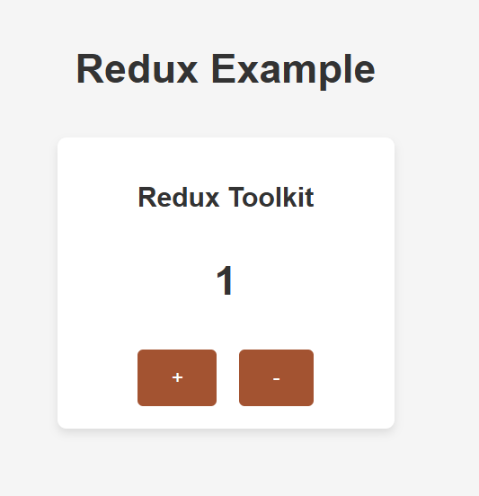

# Redux Toolkit
Redux Toolkit — это более мощная и гибкая библиотека для управления состоянием в больших приложениях, но для маленьких проектов может показаться немного сложной из-за лишнего кода и конфигураций.

## Преимущества Redux Toolkit:
- Он позволяет эффективно управлять состоянием с помощью слайсов и редьюсеров.

- Встроенная поддержка асинхронных операций.

- Лучше подходит для больших приложений с множеством состояний.

