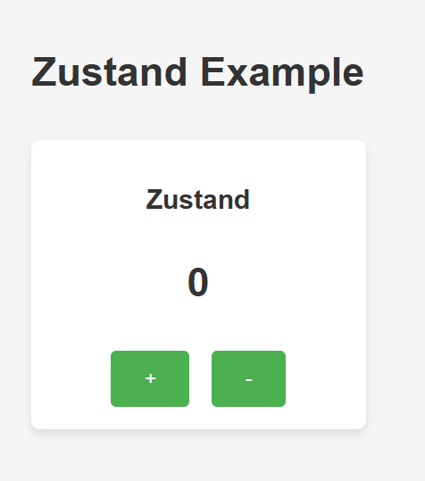

# Zustand
Zustand — это более легковесная библиотека, и я использовала её для создания простого состояния. Она не требует редьюсеров или слайсов, и всё, что нужно, это просто создать хранилище и изменять его с помощью хуков.

## Преимущества Zustand:
- Очень простой и минималистичный API.

- Отлично подходит для небольших приложений.

- Быстро и удобно, если нужно что-то простое и без лишнего кода.

